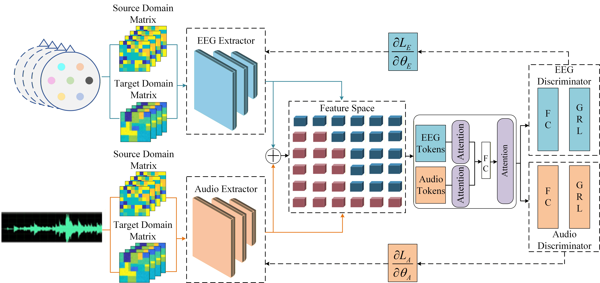
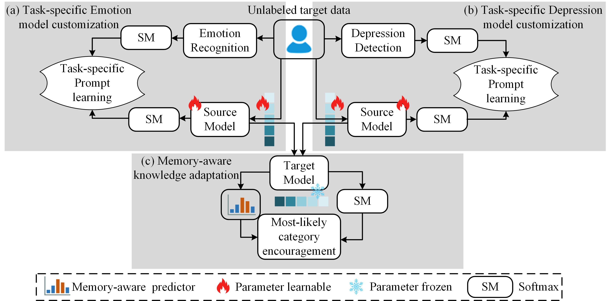

# Multimodal Emotion and Depression Co-detection Method Based on Source-Free Domain Adaptation and Task Specialization
Depression detection and emotion recognition are of significant importance in the field of mental health. Existing methods often face challenges such as data scarcity, significant individual variability, and insufficient multimodal fusion. Furthermore, previous works have not yet established a unified model to bridge these two tasks. To address this, this paper proposes a collaborative detection framework for multimodal emotion and depression based on Source-Free Domain Adaptation (SFDA) and task specialization. This framework achieves joint modeling and cross-subject generalization for emotion recognition and depression detection without requiring access to source domain data. The method utilizes electroencephalogram (EEG) signals and audio as primary modalities while fusing text information. It employs Contrastive EEG-Audio-Text Learning (CEAT) to map different modalities into a shared feature space, achieving cross-modal semantic alignment. Additionally, a task-specific SFDA strategy is introduced. By combining a freeze-thaw mechanism, knowledge distillation, and most-likely category encouragement, this strategy effectively mitigates cross-subject distribution shifts on unlabeled target domain data and enhances the collaborative optimization capability between emotion recognition and depression detection. In the depression detection task, the proposed method achieves an accuracy of 93.17\% on the MODMA dataset. In the cross-subject emotion recognition task, it achieves classification accuracies of 87.79\% and 62.11\% on the SEED and SEED-IV datasets, respectively. Experiments fully verify the performance of the proposed method in the collaborative task of multimodal emotion recognition and depression detection.

Method Overview


Feature Extractors


Task-specific SFDA



# CEAT + SFDA  Skeleton

This repo provides a runnable skeleton for:
- Multimodal encoders (EEG/Audio/Text)
- CEAT-style contrastive alignment (E-A, E-T, A-T)
- Source training (supervised)
- Target SFDA adaptation 
- Evaluation

## Quick start
```bash
pip install -r requirements.txt


python scripts/_debug_data.py

python scripts/_debug_model.py

python scripts/train_source.py --data_cfg configs/seed.yaml --model_cfg configs/model.yaml

python scripts/adapt_target_sfda.py --data_cfg configs/seed.yaml --model_cfg configs/model.yaml --sfda_cfg configs/sfda.yaml \
  --source_ckpt runs/seed_emotion/source_best.pt

python scripts/evaluate.py --data_cfg configs/seed.yaml --model_cfg configs/model.yaml --ckpt runs/seed_emotion/source_best.pt
